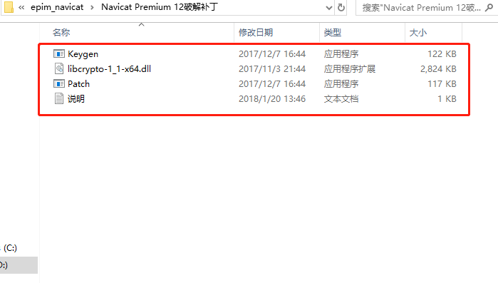
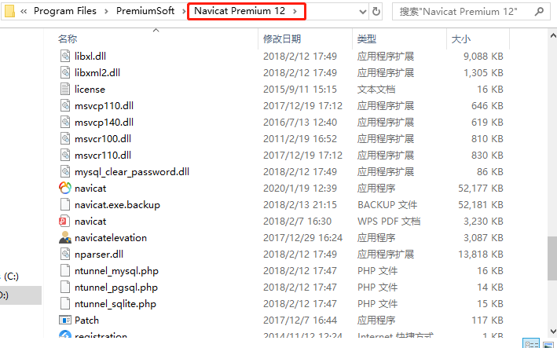
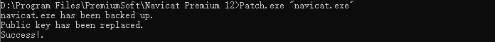
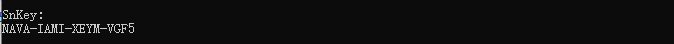
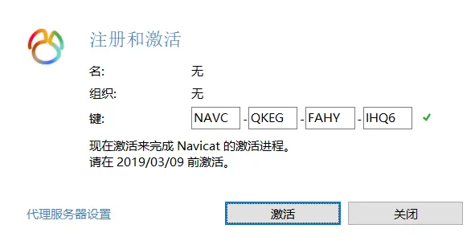
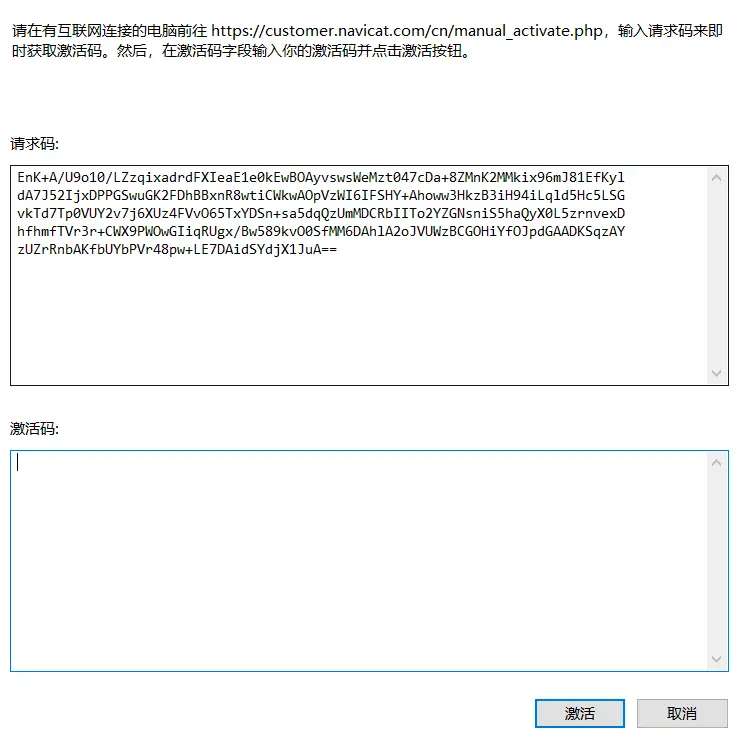
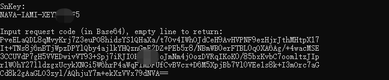

# navicat-for-windows
guides for Navicat cracked version

**注：该教程针对navicat 12.0.xx版本windows 64位，文章编写时间2020-1-19** 

网上包含这块的破解版教程很丰富，可能是时间的原因，当我按照他们的教程操作时发生了一系列错误，然后花时间找解决错误的办法，所以解决之后干脆整理一篇最新的教程给各位

链接中包含破解组件压缩包和navicat客户端安装包

链接：https://pan.baidu.com/s/1xUGx2Of29JDrOndGy16HeA 
提取码：p3um

### step1: 
安装navicat客户端（也就是“navicat12024_premium_cs_x64”），一顿点击下一步，此过程没啥特别注意的。
 
 

### step2: 
将“Navicat Premium 12.0.24破解补丁”解压，然后将解压后的四个文件，全部移动到“Navicat Premium 12”下面 (也就是跟"navicat.exe"同文件夹下)，

 
 

### step3: 
**从这步断网** 
打开cmd，路径进入到"Navicat Premium 12"文件夹下，我这里是"D:\Program Files\PremiumSoft\Navicat Premium 12\" 
然后输入 Patch.exe "navicat.exe"

成功的话效果就是上面这样
 
 

### step4: 
接着输入 Keygen.exe RegPrivateKey.pem, 会提示让你输入name、organization，这块随便填，像这样

成功的话会出现snkey，像这样

然后打开桌面上的"Navicat Premium 12"，并点击注册，将那串snkey填入

点击激活,会出来下面的框，忽略框框上面的那段话"请在有互联网连接的电脑$%#^$"我们这步依然是断着网的。

然后将上面的请求码复制，粘贴到 **"Input request code (in Base64), empty line to return:"** 下，这样

然后敲击两下回车，然后会出现License (这就是激活码)，

将它们复制粘贴回激活框下，并点击激活，然后提示激活成功即可永久使用了
